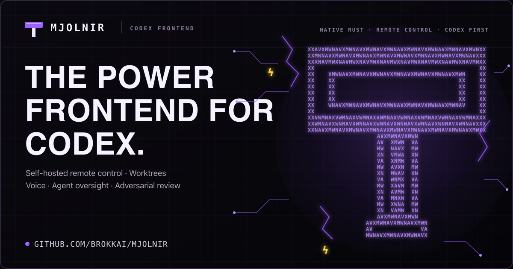
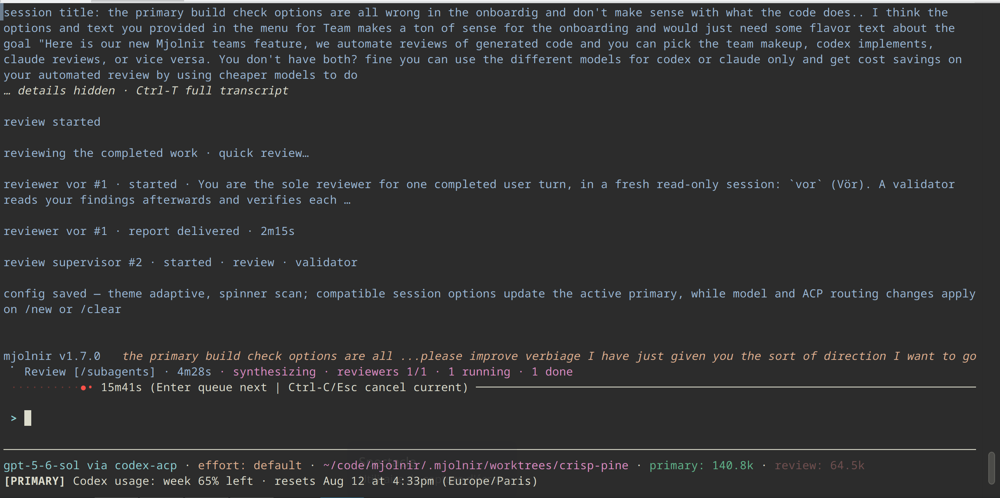

<h1 align="center">Mjolnir</h1>

<p align="center">
  <a href="https://mjolnir.brokk.ai/">
    
  </a>
</p>

Mjolnir (`mj`) is the self-hosted power frontend for **Codex**. It wraps your
existing Codex account in self-hosted remote control, a worktree-first workflow,
cross-platform voice input, and integrated adversarial review.

Codex remains in charge of the turn while Mjolnir provides the operating
environment around it:

- Codex owns every user turn — planning, delegating, implementing, and
  answering;
- Codex can launch background subagents (up to 16 in parallel, all
  write-capable, each in a fresh session) while Mjolnir tracks them;
- stable workflow progress rows summarize delegation and review phases,
  aggregate actor outcomes, and elapsed time; `/subagents` opens retained
  nested detail;
- each finished subagent's report, activity log, and diff are pushed back into
  the primary session as a new user message — nothing polls.

Mjolnir is Codex-first, not Codex-only. You can add Claude, Kimi, Anvil, or a
custom Agent Client Protocol (ACP) server as an alternative primary or as a
specialist subagent or reviewer. The terminal, permissions, sessions, tools,
and remote workflow stay consistent across those routes.



## What Mjolnir adds to Codex

- **Self-hosted remote control:** keep the workspace and control plane on your
  machine and drive the session from another browser or device.
- **Worktree-first workflow:** start Codex in a linked Git worktree so agent
  changes stay separate from your current checkout and remain easy to inspect.
- **Cross-platform desktop voice:** dictate prompts locally on macOS, Linux,
  and Windows with Ctrl-R.
- **Integrated adversarial review:** challenge workspace changes with a
  separate review supervisor and targeted specialist lanes before a delegated
  turn completes.
- **Optional agent routes:** add Claude, Kimi, Anvil, or a custom ACP server
  without replacing the Codex-first workflow.

Mjolnir itself, its remote-control server, transcripts, and workspace tools run
on infrastructure you control. Codex model requests still use OpenAI under the
terms and data boundaries of your Codex account.

## Requirements

The recommended path needs an authenticated, PATH-visible Codex CLI plus
Node.js/npm for the Codex ACP bridge. Provider use may incur cost.

Other agents are optional. Mjolnir can also use existing Claude or Kimi
credentials, install supported binary ACP agents, and manage Anvil as a bundled
or downloaded route. Read [Start with Codex](https://mjolnir.brokk.ai/codex/),
[installation](https://mjolnir.brokk.ai/install/), and the
[data and trust boundaries](https://mjolnir.brokk.ai/data-boundaries/)
before connecting a private repository.

## Install and run

With Node.js 18 or later, npm is the simplest persistent install and npx runs
Mjolnir once without changing your global packages:

```bash
npm install -g @brokkai/mjolnir
mj --version

npx -y @brokkai/mjolnir --version
```

The npm package includes the native `mj` bundle for your platform—plus bundled
Anvil and, on desktop, `mj-voice-worker`—so it does not download Mjolnir on
first run. Upgrade with `npm update -g @brokkai/mjolnir` and remove it with
`npm uninstall -g @brokkai/mjolnir`.

On macOS (Apple Silicon and Intel) and Linux (x86-64 or ARM64 glibc), install
from the Homebrew tap:

```bash
brew install brokkai/tap/mjolnir
```

The formula puts `mj` on `PATH` and keeps `mj-voice-worker` and a bundled
Anvil in its private `libexec`; it does not install Bifrost, which has its own
formula in the same tap (`brew install brokkai/tap/bifrost`). Upgrade with
`brew upgrade mjolnir`.

The release installer supports macOS and Linux on x86-64 or ARM64, plus Android ARM64:

```bash
curl -fsSL https://raw.githubusercontent.com/BrokkAi/mjolnir/master/install.sh | bash
```

It installs `mj` and Bifrost; desktop installs also include
`mj-voice-worker`. Windows users should use a release archive or Cargo.

Desktop users can install Mjolnir and its optional voice worker from crates.io:

```bash
cargo install --locked brokk-mjolnir brokk-mj-voice-worker
```

Then open a repository and run:

```bash
mj
```

First launch opens Mjolnir's configuration screen. Confirm the Codex account
and route, keep the primary model on Auto, and start the session. Return later
with `/mjconfig`. Model and adapter changes apply to the next session. If Codex
credentials or capabilities change, run `mj models refresh` before starting
Mjolnir again.

## Try it

The [10-minute Codex evaluation](https://mjolnir.brokk.ai/evaluate/) uses a
checked-in disposable fixture to exercise a delegated subagent change, its
pushed-back report, explicit review, session resume, and headless output without
risking a real repository.

For a quick read-only headless check:

```bash
mj --print --permission-mode manual "summarize this repository; do not modify files"
```

Use an isolated worktree for an interactive coding session:

```bash
mj --worktree
```

## Documentation

- [Start with Codex](https://mjolnir.brokk.ai/codex/)
- [Install and run](https://mjolnir.brokk.ai/install/)
- [10-minute Codex evaluation](https://mjolnir.brokk.ai/evaluate/)
- [Remote control](https://mjolnir.brokk.ai/remote/)
- [Voice dictation](https://mjolnir.brokk.ai/voice/)
- [Subagents](https://mjolnir.brokk.ai/subagents/)
- [Delegation and adversarial review](https://mjolnir.brokk.ai/delegation-review/)
- [Permissions and workspace scope](https://mjolnir.brokk.ai/permissions/)
- [Sessions, worktrees, and resume](https://mjolnir.brokk.ai/sessions-worktrees/)
- [Headless automation](https://mjolnir.brokk.ai/headless/)
- [Other agents and models](https://mjolnir.brokk.ai/adapters/)
- [License and use cases](https://mjolnir.brokk.ai/license-use-cases/)
- [Data and trust boundaries](https://mjolnir.brokk.ai/data-boundaries/)

## Contributing

See [CONTRIBUTING.md](CONTRIBUTING.md) for development setup, runtime
invariants, tests, dependency-license maintenance, and the release checklist.
Repository-specific agent guidance lives in [AGENTS.md](AGENTS.md).

## License

Mjolnir and its voice worker are licensed under `GPL-3.0-only`. See
[LICENSE](LICENSE). Official release archives include the corresponding source
offer, dependency reports, supplemental notices, and the legal bundle for the
shipped Anvil binary. See [License and use cases](https://mjolnir.brokk.ai/license-use-cases/)
and [Third-party notices](https://mjolnir.brokk.ai/third-party-notices/).
