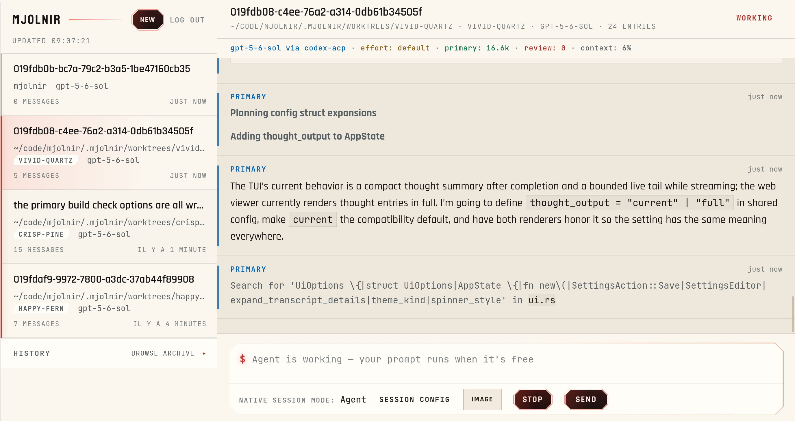

<h1 align="center">Mjolnir</h1>

<p align="center">
  <a href="https://mjolnir.brokk.ai/">
    
  </a>
</p>

Mjolnir (`mj`) is a full-featured frontend for **Codex and Claude**. It gives
both agents the same terminal workflow, team configuration, review pipeline,
and remote-control surface.

## Features

- **Codex and Claude teams:** use either agent for coding and review, or split
  the roles between them without changing tools or workflows.
- **Parallel subagents:** delegate to as many as 16 write-capable agents in
  fresh sessions, with live progress and completed reports returned to the
  primary agent.
- **Integrated adversarial review:** automatically challenge changed turns
  with an independent reviewer and targeted specialist checks.
- **Worktree sessions:** start work in a linked Git worktree and keep agent
  changes separate from the current checkout, whichever coder you choose.
- **Shared project knowledge:** carry verified discoveries across Claude and
  Codex sessions through one local, inspectable memory interface synchronized
  into each provider's native memory files.
- **Remote control:** run the workspace and control plane on your machine while
  driving the session from another browser or device.
- **Local voice input:** dictate prompts on macOS, Linux, and Windows with
  cross-platform, on-device speech recognition.

### Terminal


### Web interface



## Four teams, one shortcut

Choose one of four teams during onboarding, from `/mjconfig`, or with
**Shift+Tab** in a session:

- **Codex**
- **Claude**
- **Codex coder + Claude reviewer**
- **Claude coder + Codex reviewer**

The coder owns the primary session. The reviewer backs the independent review
pass that challenges changed turns, plus the default subagent pool. Switching
teams keeps Mjolnir's terminal, permissions, sessions, tools, and remote
workflow unchanged.

Mjolnir itself, its remote-control server, transcripts, and workspace tools run
on infrastructure you control. Model requests still use the selected provider
under its terms and data boundaries.

## Shared project knowledge

Claude and Codex should not have to rediscover the same build requirement,
architecture constraint, or debugging conclusion in separate sessions.
Mjolnir gives both agents one local project-knowledge layer and synchronizes it
into their native memory files before sessions start.

Agents can save verified discoveries as they work, or you can manage them
directly:

```bash
mj memory list
mj memory add "Release builds must run through Nix"
mj memory add --global "Prefer concise commit messages"
mj memory forget m7
```

Use `/memory` for the same workflow inside an interactive session. Knowledge
can be project-scoped or global, remains readable in Mjolnir's local
`memories.json`, and is synchronized into provider-native memory rather than
being added to a user prompt.

Mjolnir imports Claude Code's native project `MEMORY.md` into its shared store,
then writes a managed section to Claude and Codex native memory files. This
lets a discovery made in one agent remain useful when you switch teams without
altering either provider's user messages.

See [Shared project knowledge](https://mjolnir.brokk.ai/configuration/#shared-project-knowledge)
for behavior, controls, and source ownership.

## Requirements

You need credentials for at least one configured model provider. Mjolnir ships
with built-in Codex and Claude ACP routes (and Anvil on Android) and manages
the Node.js runtime those routes need: an embedded Node 24 on macOS, Linux,
and Windows, and Termux's nodejs package on Android (installed via `pkg` when
npx is missing). A system Node.js installation is only required when
installing through npm/npx. Provider use may incur cost.

Review the
[data and trust boundaries](https://mjolnir.brokk.ai/data-boundaries/) before
connecting a private repository.

## Install

Choose any of the following methods.

**Release installer:** macOS and Linux on x86-64 or ARM64; Android on ARM64:

```bash
curl -fsSL https://raw.githubusercontent.com/BrokkAi/mjolnir/master/install.sh | bash
```

**Homebrew:** macOS (Apple Silicon or Intel) and Linux (x86-64 or ARM64 glibc):

```bash
brew install brokkai/tap/mjolnir
```

**npm or npx:** macOS, Linux, Windows, and Android with Node.js 18 or later:

```bash
npm install -g @brokkai/mjolnir
# Or run without a global install:
npx -y @brokkai/mjolnir
```

**crates.io:** install the terminal client and desktop voice worker with Rust:

```bash
cargo install --locked brokk-mjolnir brokk-mj-voice-worker
```

**Release archive:** download the archive for Linux, macOS, Windows, or
Android from [GitHub Releases](https://github.com/BrokkAi/mjolnir/releases).

**Build from source:**

```bash
git clone https://github.com/BrokkAi/mjolnir.git
cd mjolnir
cargo build --release
./target/release/mj --cwd .
```

Desktop release packages include `mj-voice-worker`; Android packages omit
voice support. See the full [installation guide](https://mjolnir.brokk.ai/install/)
for platform details, upgrades, checksums, and custom install paths.

## Run

Open a repository and run:

```bash
mj
```

First launch discovers available provider credentials and opens setup on the
team those credentials support: **Claude coder + Codex reviewer** with both
providers signed in, or that provider's own team with one. Press **Shift+Tab**
to switch teams later, or open the **Team** tab in `/mjconfig`. Team, model,
and adapter changes apply to a new session.

## Try it

The [10-minute evaluation](https://mjolnir.brokk.ai/evaluate/) uses a
checked-in disposable fixture to exercise a delegated subagent change, its
pushed-back report, explicit review, session resume, and headless output without
risking a real repository.

For a quick read-only headless check:

```bash
mj --print --permission-mode manual "summarize this repository; do not modify files"
```

Use an isolated worktree for an interactive coding session:

```bash
mj --worktree
```

## Documentation

- [Teams and adversarial review](https://mjolnir.brokk.ai/teams/)
- [Install and run](https://mjolnir.brokk.ai/install/)
- [Start with Codex](https://mjolnir.brokk.ai/codex/)
- [Start with Claude](https://mjolnir.brokk.ai/claude/)
- [10-minute evaluation](https://mjolnir.brokk.ai/evaluate/)
- [Remote control](https://mjolnir.brokk.ai/remote/)
- [Voice dictation](https://mjolnir.brokk.ai/voice/)
- [Subagents](https://mjolnir.brokk.ai/subagents/)
- [Shared project knowledge](https://mjolnir.brokk.ai/configuration/#shared-project-knowledge)
- [Delegation and adversarial review](https://mjolnir.brokk.ai/delegation-review/)
- [Permissions and workspace scope](https://mjolnir.brokk.ai/permissions/)
- [Sessions, worktrees, and resume](https://mjolnir.brokk.ai/sessions-worktrees/)
- [Headless automation](https://mjolnir.brokk.ai/headless/)
- [Other agents and models](https://mjolnir.brokk.ai/adapters/)
- [License and use cases](https://mjolnir.brokk.ai/license-use-cases/)
- [Data and trust boundaries](https://mjolnir.brokk.ai/data-boundaries/)

## Contributing

See [CONTRIBUTING.md](CONTRIBUTING.md) for development setup, runtime
invariants, tests, and dependency-license maintenance. Maintainers tagging a
release should follow [RELEASING.md](RELEASING.md). Repository-specific agent
guidance lives in [AGENTS.md](AGENTS.md).

## License

Mjolnir and its voice worker are licensed under `GPL-3.0-only`. See
[LICENSE](LICENSE). Official release archives include the corresponding source
offer, dependency reports, and supplemental notices.
See [License and use cases](https://mjolnir.brokk.ai/license-use-cases/)
and [Third-party notices](https://mjolnir.brokk.ai/third-party-notices/).
